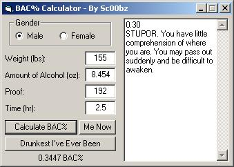



## BAC Calculator

### Description

This is a Blood Alcohol Content (BAC) Calculator. You put in your gender, weight, amount you've had, and how long it's been and it tells you your BAC%. I thought it might be good for those ppl drinking tonight since it's St. Patric's Day.
 
### More Info
 

             |
---                |---
**Submitted On**   |2005-03-17 18:37:36
**By**             |[Sc00bz](https://github.com/Planet-Source-Code/PSCIndex/blob/master/ByAuthor/sc00bz.md)
**Level**          |Beginner
**User Rating**    |4.3 (13 globes from 3 users)
**Compatibility**  |VB 6\.0
**Category**       |[Math/ Dates](https://github.com/Planet-Source-Code/PSCIndex/blob/master/ByCategory/math-dates__1-37.md)
**World**          |[Visual Basic](https://github.com/Planet-Source-Code/PSCIndex/blob/master/ByWorld/visual-basic.md)
**Archive File**   |[BAC\_Calcul1865673172005\.zip](https://github.com/Planet-Source-Code/sc00bz-bac-calculator__1-59525/archive/master.zip)

